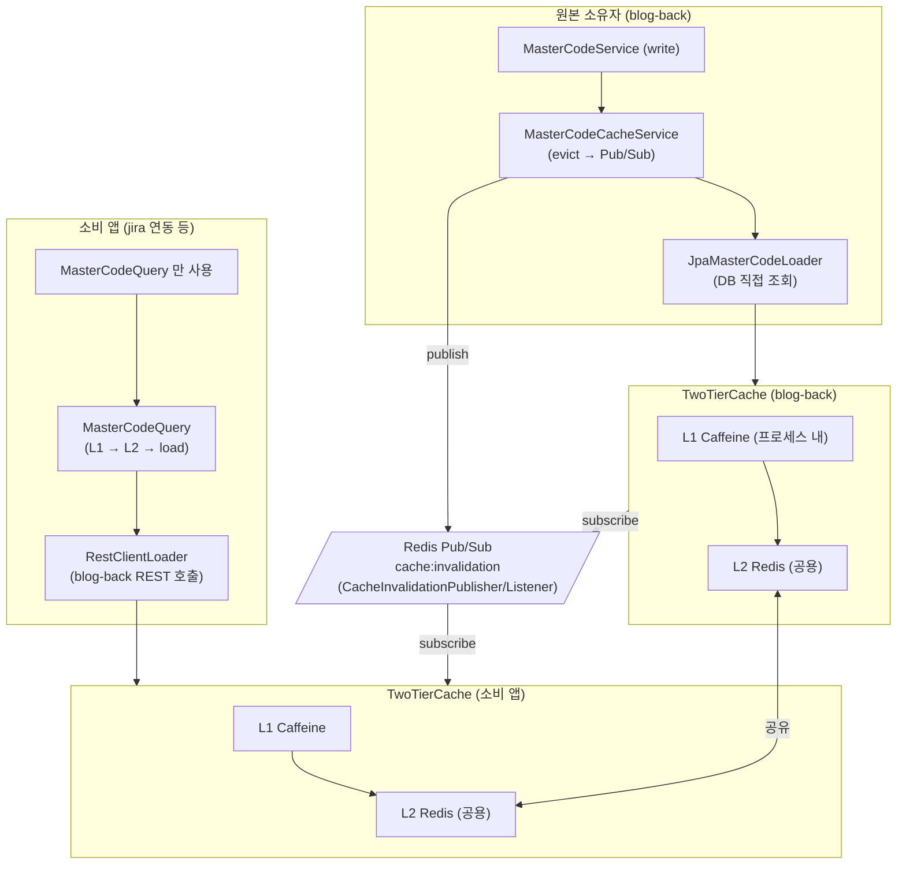

# 마스터코드 공통 캐시 모듈 (`masterdata`)

`kr.hvy.common.infrastructure.redis.impl.masterdata` 패키지는 여러 Spring Boot 앱이 동일한 마스터코드 데이터를
L1(Caffeine) + L2(Redis) 2단계 캐시로 공유할 수 있게 해 주는 모듈이다.

## 1. 아키텍처 개요



**핵심 원칙:** blog-back 과 소비 앱은 동일한 `MasterCodeQuery` Facade 를 쓰고, 차이는 주입되는
`MasterCodeLoader` 구현체 뿐이다.

- blog-back → `JpaMasterCodeLoader` (DB 직접 조회)
- 소비 앱 → `RestClientMasterCodeLoader` (blog-back REST 호출)

**쓰기 권한은 blog-back 에만 있으며**, blog-back 에서 evict 하면 Redis Pub/Sub 으로 모든 인스턴스의
L1 캐시가 자동 drop 된다 (크로스-Pod/크로스-앱 무효화).

---

## 2. 모듈 구성

| 패키지 | 타입 | 설명 |
|---|---|---|
| `masterdata.dto.MasterCodeResponse` | record 유사 POJO | 단건 응답 DTO. Redis L2 직렬화용 고정 FQCN. |
| `masterdata.dto.MasterCodeTreeResponse` | record 유사 POJO | 트리 응답 DTO. |
| `masterdata.cache.MasterCodeCacheNames` | 상수 | `TREE`, `NODE`, `CHILDREN` 캐시 이름. |
| `masterdata.cache.MasterCodeCacheProperties` | 팩토리 | `all()` / `all(l1Ttl, l2Ttl)` → `TwoTierCacheProperties` 리스트. |
| `masterdata.cache.MasterCodeCacheService` | 빈 | `CacheManager` 위 도메인 키 규약 래퍼. `evict*` 메서드 제공. |
| `masterdata.query.MasterCodeLoader` | 인터페이스 (SPI) | 캐시 미스 시 원본 조회. 구현체는 JPA 또는 REST. |
| `masterdata.query.MasterCodeQuery` | 빈 | cache-aside Facade. 공용 엔트리포인트. |
| `masterdata.query.MasterCodeClientProperties` | `@ConfigurationProperties` | `hvy.masterdata.client.*` 속성 바인딩. |
| `masterdata.query.RestClientMasterCodeLoader` | 빈 (소비 앱 전용) | Spring `RestClient` 로 blog-back 호출. |
| `masterdata.config.MasterDataCommonConfig` | `@Configuration` | `MasterCodeCacheService` + `MasterCodeQuery` 등록. |
| `masterdata.config.MasterDataRestClientConfig` | `@Configuration` | 소비 앱용 REST Loader 등록. `hvy.masterdata.client.base-url` 속성이 있을 때만 활성. |

---

## 3. 원본 소유자(blog-back) 에서의 사용

### 3.1 CacheManager 에 masterCode 캐시 3종 추가

```java
package kr.hvy.blog.infra.config;

import java.util.ArrayList;
import java.util.Arrays;
import java.util.List;
import kr.hvy.blog.modules.common.cache.domain.code.CacheType;
import kr.hvy.common.config.cache.TwoTierCacheConfigurer;
import kr.hvy.common.config.cache.TwoTierCacheProperties;
import kr.hvy.common.infrastructure.redis.impl.masterdata.cache.MasterCodeCacheProperties;
import org.springframework.cache.CacheManager;
import org.springframework.context.annotation.Bean;
import org.springframework.context.annotation.Configuration;

@Configuration
public class CacheConfig extends TwoTierCacheConfigurer {

  @Bean
  public CacheManager cacheManager() {
    List<TwoTierCacheProperties> props = new ArrayList<>();
    Arrays.stream(CacheType.values()).map(CacheType::getProperties).forEach(props::add);
    props.addAll(MasterCodeCacheProperties.all());      // 공통 모듈의 기본 설정 병합
    return super.twoTierCacheManager(props);
  }
}
```

### 3.2 JPA Loader 와 Config 등록

```java
package kr.hvy.blog.modules.admin.infrastructure.config;

import kr.hvy.blog.modules.admin.infrastructure.cache.JpaMasterCodeLoader;
import kr.hvy.blog.modules.admin.mapper.MasterCodeDtoMapper;
import kr.hvy.blog.modules.admin.repository.MasterCodeRepository;
import kr.hvy.common.infrastructure.redis.impl.masterdata.config.MasterDataCommonConfig;
import kr.hvy.common.infrastructure.redis.impl.masterdata.query.MasterCodeLoader;
import org.springframework.context.annotation.Bean;
import org.springframework.context.annotation.Configuration;
import org.springframework.context.annotation.Import;

@Configuration
@Import(MasterDataCommonConfig.class)   // ← MasterCodeCacheService + MasterCodeQuery 빈 자동 등록
public class MasterDataConfig {

  @Bean
  public MasterCodeLoader masterCodeLoader(
      MasterCodeRepository repo,
      MasterCodeDtoMapper mapper) {
    return new JpaMasterCodeLoader(repo, mapper);
  }
}
```

### 3.3 서비스에서 사용

```java
// 읽기 — Facade 한 줄
@Transactional(readOnly = true)
public List<MasterCodeTreeResponse> getFullTree() {
  return masterCodeQuery.getFullTree();
}

// 쓰기 — CRUD 후 evict 호출
public MasterCodeResponse updateNode(Long id, MasterCodeUpdate dto) {
  // ... 저장 로직 ...
  cacheService.evictByRootCode(findRootCode(saved));  // Pub/Sub 으로 다른 인스턴스 L1 자동 drop
  return mapper.toResponse(saved);
}
```

---

## 4. 소비 앱(예: jira 연동 모듈) 에서의 사용

**전제:** 같은 Redis 인스턴스에 접속 가능하고, blog-back 의 REST API (`/api/v1/codes/tree/*`) 에 네트워크 도달 가능.

### 4.1 의존성

```gradle
implementation('io.github.motolies:hvy-common:<version>') {
  exclude group: 'org.springframework.cloud', module: 'spring-cloud-stream'
  exclude group: 'org.springframework.cloud', module: 'spring-cloud-stream-binder-kafka'
}
```

### 4.2 application.yml

```yaml
spring:
  data:
    redis:
      host: shared-redis.internal
      port: 6379

hvy:
  masterdata:
    client:
      base-url: https://blog-back.internal
      timeout: 2s                    # 선택, 기본 2초
      # api-key: ${MASTERDATA_API_KEY}   # 선택, 있으면 Authorization: Bearer 로 전달
```

### 4.3 Redis · Cache · MasterData Config

```java
// Redis
@Configuration
public class RedisConfig extends RedisConfigurer { }

// Cache: 마스터코드 3종만 등록해도 되고, 자체 캐시와 함께 등록해도 된다
@Configuration
public class CacheConfig extends TwoTierCacheConfigurer {
  @Bean
  public CacheManager cacheManager() {
    return super.twoTierCacheManager(MasterCodeCacheProperties.all());
  }
}

// MasterCode 조회 스택
@Configuration
@Import({MasterDataCommonConfig.class, MasterDataRestClientConfig.class})
public class MasterDataConfig { }
```

`MasterDataRestClientConfig` 는 `hvy.masterdata.client.base-url` 속성이 있으면 자동으로
`RestClientMasterCodeLoader` 를 `MasterCodeLoader` 빈으로 등록한다. 이후 `MasterDataCommonConfig` 가
`MasterCodeCacheService` 와 `MasterCodeQuery` 를 완성한다.

### 4.4 사용 예

```java
@Service
@RequiredArgsConstructor
public class JiraIssueTypeMapper {

  private final MasterCodeQuery masterCodeQuery;

  public List<MasterCodeResponse> issueTypes() {
    return masterCodeQuery.getChildren("JIRA_ISSUE_TYPE");
  }

  public List<MasterCodeTreeResponse> allCodes() {
    return masterCodeQuery.getFullTree();
  }
}
```

**동작:**
1. 첫 호출 → 소비 앱 L1 미스 → L2 조회 → blog-back 이 이미 시드했으면 히트, 없으면 REST 호출 → L1+L2 시드.
2. 반복 호출 → L1 히트 (프로세스 내 즉시 반환).
3. blog-back 에서 `POST /api/v1/codes/nodes` 로 코드 수정 → blog-back 이 L1+L2 evict 후 Redis Pub/Sub 발행
   → 소비 앱의 `CacheInvalidationListener` 가 이벤트 수신 → 해당 L1 자동 drop → 다음 호출은 L2 재조회 또는 REST.

---

## 5. 크로스-Pod / 크로스-앱 무효화 (자동)

`TwoTierCache.evict()` 내부에서 `CacheInvalidationPublisher` 가 `cache:invalidation` 토픽으로 메시지를 발행하고,
`CacheInvalidationListener` (자동 빈) 가 같은 Redis 에 붙은 모든 인스턴스에서 자기 L1 을 drop 한다.

조건:

- 소비 앱에 `RedissonClient` 빈이 존재할 것 (`RedisConfigurer` 상속으로 충족)
- 소비 앱에 `TwoTierCacheConfigurer` 상속 Config 가 존재할 것 (위 §4.3 참조)

위 두 가지만 있으면 `CacheInvalidationConfig` 가 `@ConditionalOnBean` 으로 자동 활성화된다.
blog-back 의 write 와 소비 앱의 read 가 별도 설정 없이 동기화된다.

---

## 6. L2(Redis) 호환성 / wire format 주의사항

`TwoTierCacheConfigurer` 의 L2 ObjectMapper 는 `DefaultTyping.EVERYTHING` 을 써서 JSON 에 **FQCN(완전 클래스명)** 을
박는다. 즉:

- blog-back 과 소비 앱은 반드시 **동일 패키지의 동일 DTO 클래스** 를 classpath 에 가져야 한다.
  → 이 이유로 `MasterCodeResponse` / `MasterCodeTreeResponse` 가 hvy-common 에 위치한다.
- 소비 앱은 DTO 를 자기 패키지로 복사/재정의 하면 안 된다.
- hvy-common 업그레이드 시 DTO 필드 추가는 안전(`@Jacksonized` 로 누락 필드 무시), 제거/타입 변경은 캐시 flush 필요.

**DTO 패키지를 이동하거나 필드 타입을 바꾸는 배포는 반드시 Redis 의 해당 키들을 flush 한 뒤 재기동해야 한다.**

```bash
redis-cli --scan --pattern 'cache:masterCode*' | xargs redis-cli del
```

안전망: `TwoTierCache.safeGetL2()` 가 역직렬화 실패 시 warn 로그 후 null 반환 → 자동으로 loader 재조회.
다만 로그 노이즈가 발생하므로 flush 가 권장된다.

---

## 7. 기본 캐시 설정

`MasterCodeCacheProperties.all()` 기본값:

| 캐시 이름 | L1 TTL | L1 max | L2 TTL |
|---|---|---|---|
| `masterCodeTree` | 6h | 50 | 1d |
| `masterCodeNode` | 6h | 200 | 1d |
| `masterCodeChildren` | 6h | 100 | 1d |

필요 시 `MasterCodeCacheProperties.all(Duration.ofHours(1), Duration.ofHours(12))` 처럼 커스텀.

---

## 8. 트러블슈팅

| 증상 | 원인 | 대응 |
|---|---|---|
| `IllegalStateException: CacheManager 에 'masterCodeTree' 캐시가 등록되지 않았습니다` | `CacheConfig` 에서 `MasterCodeCacheProperties.all()` 을 병합하지 않음 | §3.1 / §4.3 참조 |
| `NoSuchBeanDefinitionException: MasterCodeCacheService` | `MasterDataCommonConfig` 를 `@Import` 하지 않음 | `@Import(MasterDataCommonConfig.class)` 추가 |
| `NoSuchBeanDefinitionException: MasterCodeLoader` | Loader 빈 미등록 | blog-back: `JpaMasterCodeLoader`, 소비 앱: `MasterDataRestClientConfig` 를 import 하거나 직접 빈 등록 |
| L2 읽기 시 warn 로그 `L2 cache deserialize failed` | DTO 패키지/필드 변경 후 기존 Redis 값 잔존 | `redis-cli del` 로 `cache:masterCode*` 키 flush |
| 다른 인스턴스에서 캐시 무효화가 전파되지 않음 | `RedissonClient` 또는 `TwoTierCacheConfigurer` 빈 누락으로 `CacheInvalidationConfig` 비활성 | `RedisConfigurer` + `TwoTierCacheConfigurer` 상속 확인 |
| 소비 앱 첫 호출마다 REST 호출이 발생 | L2 가 비어 있음 | 정상 동작. 첫 호출 후 L2 가 시드되어 이후는 L1/L2 히트 |
| 소비 앱에서 `RestClientMasterCodeLoader` 초기화 실패 | `hvy.masterdata.client.base-url` 미설정 | application.yml 에 속성 추가 |

---

## 9. 확장 지점

- **인증이 필요한 경우**: `MasterCodeClientProperties.apiKey` 설정 시 `Authorization: Bearer {apiKey}` 헤더 자동 전송.
  더 복잡한 인증 체계가 필요하면 `RestClientMasterCodeLoader` 를 상속하여 커스터마이즈.
- **회로 차단기 / 재시도**: 본 모듈은 단순성을 위해 넣지 않았다. Resilience4j 를 소비 앱 레벨에서
  `MasterCodeLoader` 래퍼로 추가 가능.
- **다른 원본(예: gRPC, Kafka 스냅샷)** 을 쓰고 싶으면 `MasterCodeLoader` 를 직접 구현하고
  `MasterDataRestClientConfig` 를 import 하지 않으면 된다.

---

## 10. 관련 파일

- 본 패키지: `hvy-common/src/main/java/kr/hvy/common/infrastructure/redis/impl/masterdata/`
- 의존 인프라: `kr.hvy.common.config.cache.TwoTierCache*`,
  `kr.hvy.common.infrastructure.redis.cache.CacheInvalidation*`,
  `kr.hvy.common.infrastructure.redis.config.RedisConfigurer`
- blog-back 사용 예: `hvy-blog/src/main/java/kr/hvy/blog/modules/admin/infrastructure/{cache,config}/`
